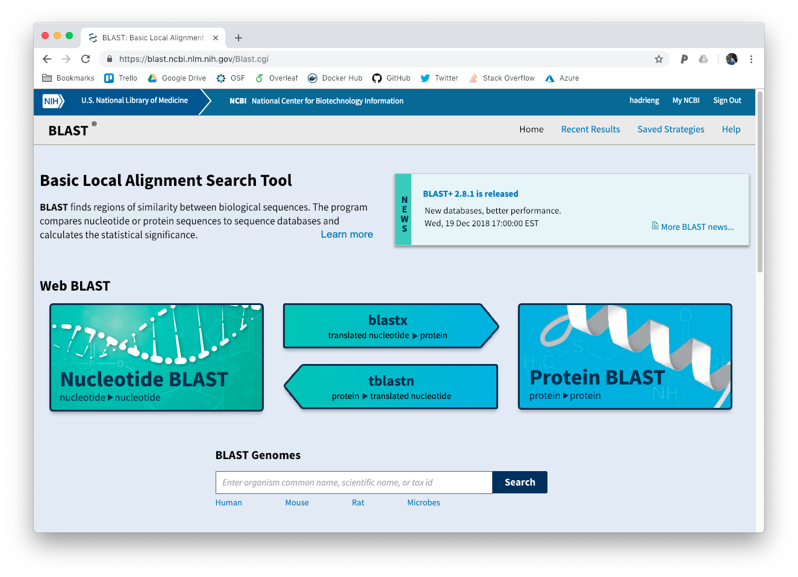
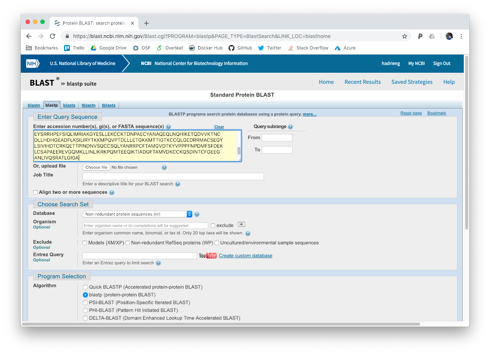
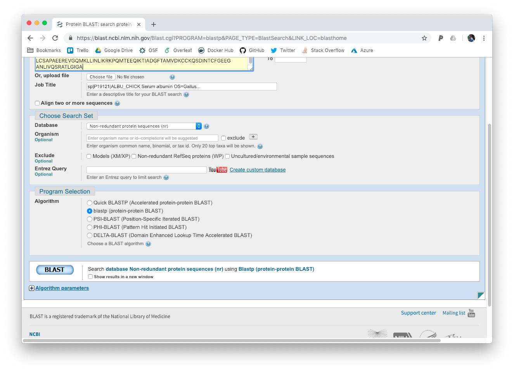
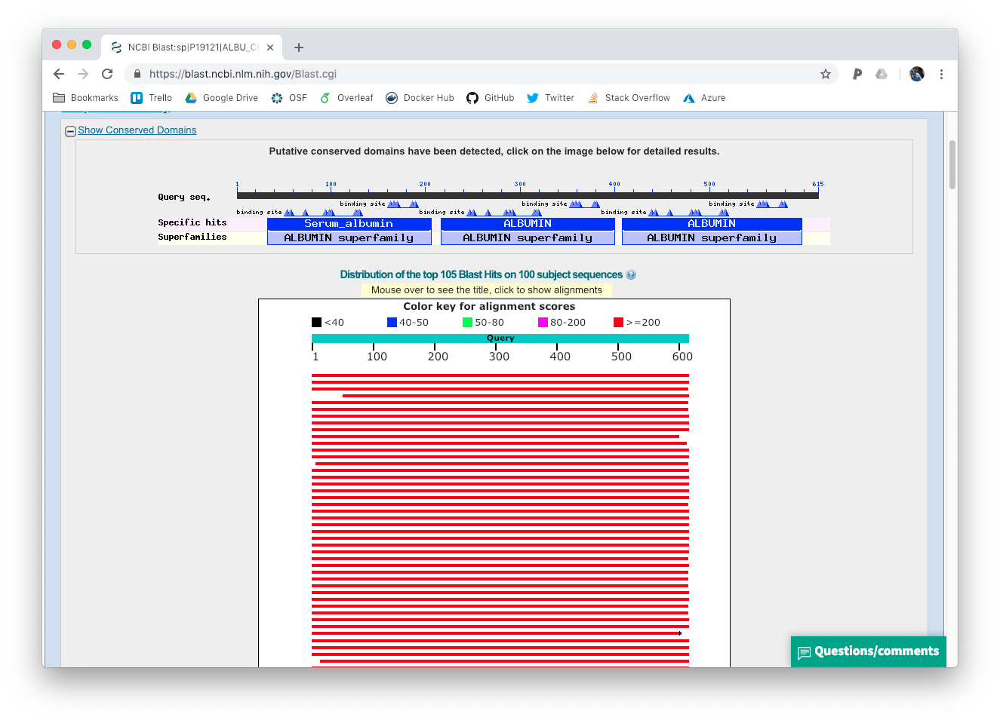

# Using Blast online

Blast is one of the most used bioinformatics tools ever written.
It allows to find similaroties between sequences of proteins or nucleotides, at a reasonable speed.!

Its ancestor, the fasta suite (like the format) used an algorithm clled smith-waterman.
While very accurate, was very slow.

Blast is available opnline on the ncbi website at the following address <https://blast.ncbi.nlm.nih.gov/Blast.cgi>

Let us try it out!

### Your first blast

go on the blast ncbi website and select protein blast



Copy and paste the following protein sequence

```bash
>a_protein
MKWVTLISFIFLFSSATSRNLQRFARDAEHKSEIAHRYNDLKEETFKAVAMITFAQYLQR
CSYEGLSKLVKDVVDLAQKCVANEDAPECSKPLPSIILDEICQVEKLRDSYGAMADCCSK
ADPERNECFLSFKVSQPDFVQPYQRPASDVICQEYQDNRVSFLGHFIYSVARRHPFLYAP
AILSFAVDFEHALQSCCKESDVGACLDTKEIVMREKAKGVSVKQQYFCGILKQFGDRVFQ
ARQLIYLSQKYPKAPFSEVSKFVHDSIGVHKECCEGDMVECMDDMARMMSNLCSQQDVFS
GKIKDCCEKPIVERSQCIMEAEFDEKPADLPSLVEKYIEDKEVCKSFEAGHDAFMAEFVY
EYSRRHPEFSIQLIMRIAKGYESLLEKCCKTDNPAECYANAQEQLNQHIKETQDVVKTNC
DLLHDHGEADFLKSILIRYTKKMPQVPTDLLLETGKKMTTIGTKCCQLGEDRRMACSEGY
LSIVIHDTCRKQETTPINDNVSQCCSQLYANRRPCFTAMGVDTKYVPPPFNPDMFSFDEK
LCSAPAEEREVGQMKLLINLIKRKPQMTEEQIKTIADGFTAMVDKCCKQSDINTCFGEEG
ANLIVQSRATLGIGA
```

into the "enter query sequence" form



and click "Blast" (you may have to scroll down a bit)



then wait for your results.
Once the results have loaded, scroll down to the first hit.

!!! question
    From which organism is our protein? What is it?



!!! note
    Sometyimes, two hits have an identical score. In that case, be careful with the interpretation.


### Restrict the search parameters

Let us imagine we'd like to compare our query to only human proteins.
We can select an organism to restrict our search.


!!! question
    What is the percentage identidy between the chicken and human albumin?

!!! question
    Here is an unknown protein. From which organism and which function does it have?
    
    `MVLSAADKGNVKAAWGKVGGHAAEYGAEALERMFLSFPTTKTYFPHFDLSHGSAQVKGHG`  
    `AKVAAALTKAVEHLDDLPGALSELSDLHAHKLRVDPVNFKLLSHSLLVTLASHLPSDFTP`  
    `AVHASLDKFLANVSTVLTSKYR`

### What's next?

[The Command-line](../unix)
[An Introduction to Cloud computing](../cloud)